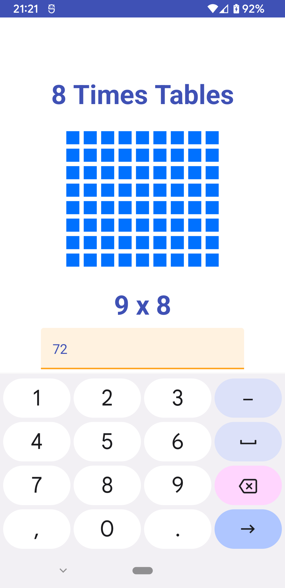

# times-tables
A simple app to help practice your times tables built with

- [Orbit MVI](https://orbit-mvi.org/) to simplify state and side-effect architecture
- Jetpack Compose for rendering most of the UI
- Dagger Hilt for dependency management
- Lottie for animations 

     

Lottie animations from [Pavlo Monakhov](https://lottiefiles.com/pavlo)

